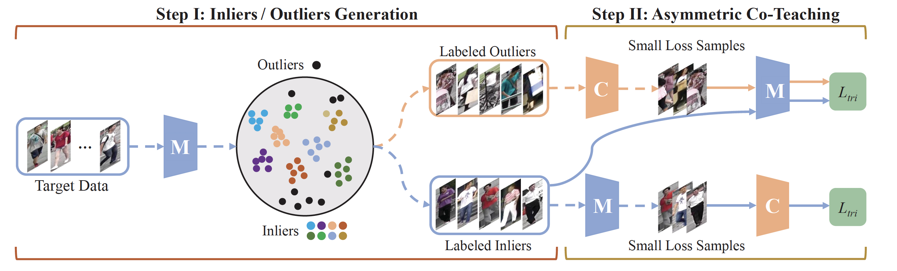

# [Asymmetric Co-Teaching for Unsupervised Cross Domain Person Re-Identification](https://ojs.aaai.org/index.php/AAAI/article/download/6950/6804)

Asymmetric Co-Teaching for Unsupervised Cross Domain Person Re-Identification is our paper published in AAAI2020. In this paper, we design an asymmetric co-teaching framework, which resists noisy labels by cooperating two models to select data with possibly clean labels for each other. Meanwhile, one of the models receives samples as pure as possible, while the other takes in samples as diverse as possible. This procedure encourages that the selected training samples can be both clean and miscellaneous, and that the two models can promote each other iteratively.


## peformance 


## Citation
If you find this code useful, please cite the following paper:

```
@inproceedings{yang2020asymmetric,
  title={Asymmetric co-teaching for unsupervised cross-domain person re-identification},
  author={Yang, Fengxiang and Li, Ke and Zhong, Zhun and Luo, Zhiming and Sun, Xing and Cheng, Hao and Guo, Xiaowei and Huang, Feiyue and Ji, Rongrong and Li, Shaozi},
  booktitle={Proceedings of the AAAI Conference on Artificial Intelligence},
  volume={34},
  number={07},
  pages={12597--12604},
  year={2020}
}
```