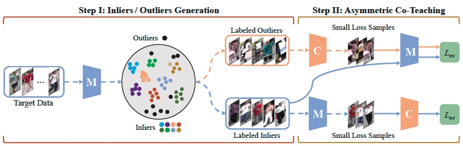

# [Asymmetric Co-Teaching for Unsupervised Cross Domain Person Re-Identification (AAAI 2020)](https://arxiv.org/abs/1912.01349). 

### Framework


### Original Repo
https://github.com/FlyingRoastDuck/ACT_AAAI20


### Performance


### Citation
If you are interested in this work, please cite our paper
```
@inproceedings{yang2020asymmetric,
  title={Asymmetric Co-Teaching for Unsupervised Cross-Domain Person Re-Identification.},
  author={Yang, Fengxiang and Li, Ke and Zhong, Zhun and Luo, Zhiming and Sun, Xing and Cheng, Hao and Guo, Xiaowei and Huang, Feiyue and Ji, Rongrong and Li, Shaozi},
  booktitle={AAAI},
  pages={12597--12604},
  year={2020}
}
```
