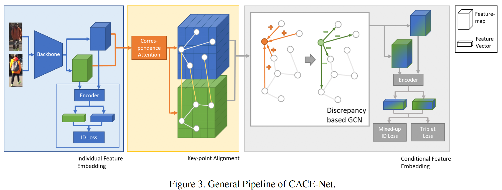
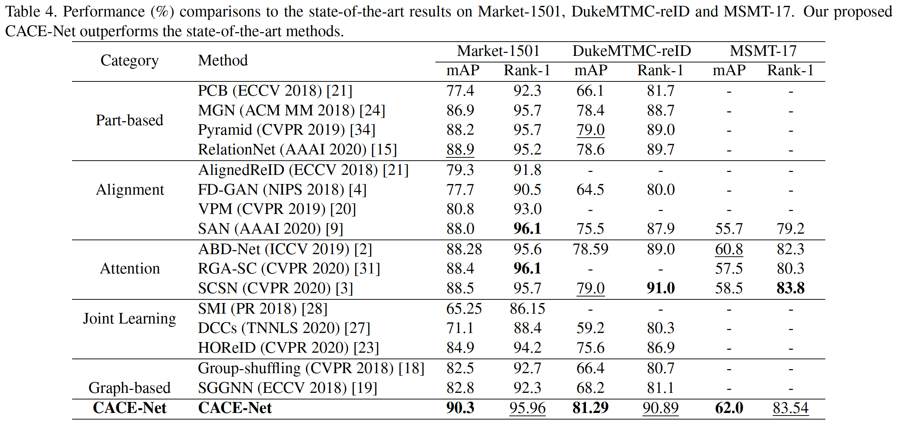

# [Devil's in the Details: Aligning Visual Clues for Conditional Embedding in Person Re-Identification](https://arxiv.org/abs/2009.05250)

Devil's in the Details: Aligning Visual Clues for Conditional Embedding in Person Re-Identification is submitted to CVPR2021. In this paper, we proposes a strategy that integrates both visual clue alignment and conditional feature embedding into a unified ReID framework. Instead of using a pre-defined Adjacency Matrix, our CACE-Net uses a novel correspondence attention module where the visual clues is automatically predicted and dynamically adjusted during training



## peformance 



## config
```yaml
yaml: 'experiment/cacenet/cacenet.yaml'
```
---
||Market1501<br>mAP&rank-1</br>|DukeMTMC<br>mAP&rank-1</br>|download|
|:-:|:-:|:-:|:-:|
|paper|90.3/95.96|81.29/90.89|-|
|this implement|89.95/96.02|-|[weight]() [log]() |
This is our tensorflow implement [tf-cacenet](waited)

## Citation
If you find this code useful, please cite the following paper:

```
@article{yu2020devil,
  title={Devil's in the Details: Aligning Visual Clues for Conditional Embedding in Person Re-Identification},
  author={Yu, Fufu and Jiang, Xinyang and Gong, Yifei and Zhao, Shizhen and Guo, Xiaowei and Zheng, Wei-Shi and Zheng, Feng and Sun, Xing},
  journal={arXiv e-prints},
  pages={arXiv--2009},
  year={2020}
}
```


