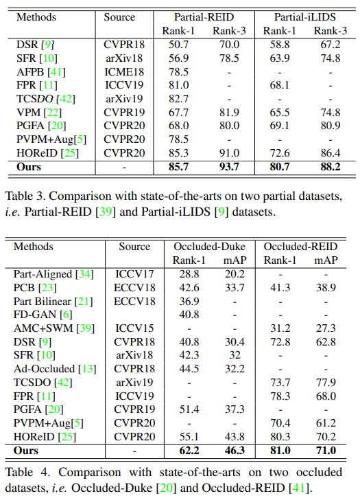

<<<<<<< HEAD
# Human Pose Information Discretization for Occluded Person Re-Identification

Person re-identification (ReID) has gain an impressive progress in recent yeas. However, the occlusion, a common issue in real world, is still challenging for recent ReID methods. Several mainstream methods utilize the extra cue (e.g., human pose information) to assist in distinguishing human parts from occluders to alleviate the occlusion problem. achieve inspiring progresses, these methods severely rely on the fine-grained extra cue, and are prone to using complicated models for the resilience to the estimation noise in the extra cue. In this paper, we first conduct a comprehensive study on the question that what effect the human pose information discretization can have on recent ReID methods. We find that precise extra cue with finer granularity is preferred by previous extra cue based methods. Although precise and fine-grained extra cue is quite useful, it is often difficult to attain in real scenarios, leading to sub-optimal ReID performances of previous methods. Then, we propose a simple but effective part-label based ReID algorithm. This algorithm focuses on learning robust part labels that are not sensitive to the granularity of the extra cue discretization. At the same time, benefiting from the part labels, appearance and structural consistent feature is acquired in an end-to-end learning scheme. Finally, with the consistent feature alignment, our algorithm outperforms current state-of-the-art person ReID algorithms on Partial Re-ID, Partial iLIDS, and Occluded-ReID datasets.


## Performance

||Partial-REID<br>rank-1&rank-3</br>|Partial-iLIDS<br>rank-1&rank-3</br>|Occluded-REID<br>mAP&rank-1</br>|Occluded-Duke<br>mAP&rank-1</br>|
|:-:|:-:|:-:|:-:|:-:|
|paper|85.7/93.7|80.7/88.2|71.0/81.0|46.3/62.2|
|this implement|85.3/91.3|79.0/89.1|72.1/80.9|50.00/60.18|





## config
```yaml
yaml: 'experiment/PartNet/market.yaml'
yaml: 'experiment/PartNet/occluded_duke.yaml'
```
## Citation

cooming soon
=======
# Human Pose Information Discretization for Occluded Person Re-Identification

Person re-identification (ReID) has gain an impressive progress in recent yeas. However, the occlusion, a common issue in real world, is still challenging for recent ReID methods. Several mainstream methods utilize the extra cue (e.g., human pose information) to assist in distinguishing human parts from occluders to alleviate the occlusion problem. achieve inspiring progresses, these methods severely rely on the fine-grained extra cue, and are prone to using complicated models for the resilience to the estimation noise in the extra cue. In this paper, we first conduct a comprehensive study on the question that what effect the human pose information discretization can have on recent ReID methods. We find that precise extra cue with finer granularity is preferred by previous extra cue based methods. Although precise and fine-grained extra cue is quite useful, it is often difficult to attain in real scenarios, leading to sub-optimal ReID performances of previous methods. Then, we propose a simple but effective part-label based ReID algorithm. This algorithm focuses on learning robust part labels that are not sensitive to the granularity of the extra cue discretization. At the same time, benefiting from the part labels, appearance and structural consistent feature is acquired in an end-to-end learning scheme. Finally, with the consistent feature alignment, our algorithm outperforms current state-of-the-art person ReID algorithms on Partial Re-ID, Partial iLIDS, and Occluded-ReID datasets.


## Performance

||Partial-REID<br>rank-1&rank-3</br>|Partial-iLIDS<br>rank-1&rank-3</br>|Occluded-REID<br>mAP&rank-1</br>|Occluded-Duke<br>mAP&rank-1</br>|
|:-:|:-:|:-:|:-:|:-:|
|paper|85.7/93.7|80.7/88.2|71.0/81.0|46.3/62.2|
|this implement|85.3/91.3|79.0/89.1|72.1/80.9|50.00/60.18|


## config
```yaml
yaml: 'experiment/PartNet/market.yaml'
yaml: 'experiment/PartNet/occluded_duke.yaml'
```
## Citation

cooming soon
>>>>>>> tmp
