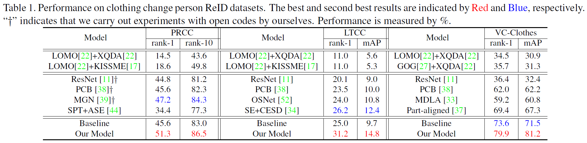
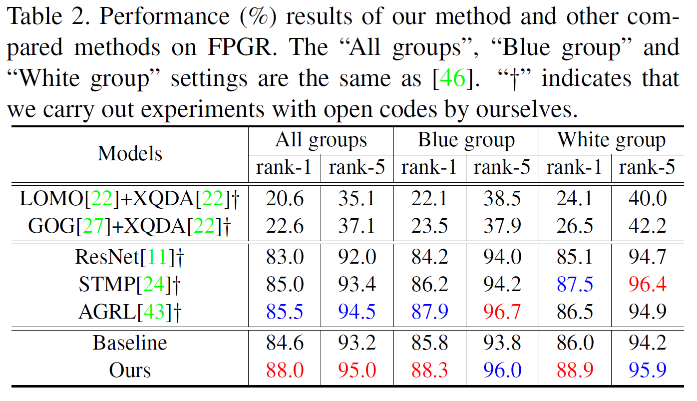
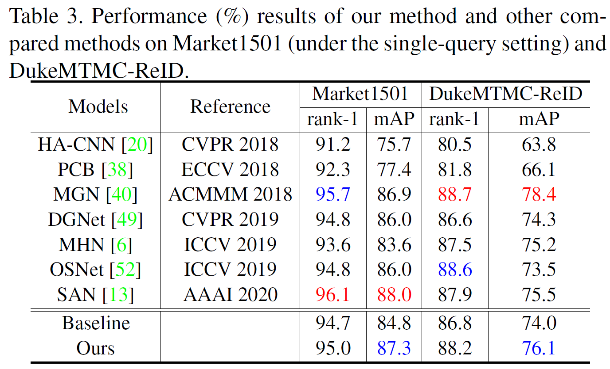

# Learning 3D Shape Feature for Texture-insensitive Person Re-identification

Code for paper [Learning 3D Shape Feature for Texture-insensitive Person Re-identification](). 

## Introduction
It is well acknowledged that person re-identification (person ReID) highly relies on visual and texture information like clothing. Despite significant progress have been made in recent years, texture-confusing situations like clothing changing or persons wearing the same clothes  are beyond the ability of most existing ReID methods. In this paper, rather than relying on texture based information, we propose to improve the robustness of person ReID to clothing texture by exploiting the information of a person's 3D shape. Existing shape learning schemas for person ReID either ignore the 3D information of person, or require extra physical devices to collect 3D source data. Instead we propose a novel ReID learning framework that directly extracts a texture-insensitive 3D shape embedding from a 2D image by adding 3D body reconstruction as an auxiliary task and regularization, called 3D Shape Learning (3DSL). Extensive experiments on common person ReID datasets and texture-confusing datasets validate the effectiveness of our model.

## Model Framework


## Citation
If you are interested in this work, please cite our paper
```

```

## Performance
### On clothing changing datasets


### On fine grained datasets


### On common datasets


## Prerequisites
- python 3.7
- pytorch 1.2
- torchvision 0.4.0
- CUDA 10.0
- [neural_renderer_pytorch](https://github.com/daniilidis-group/neural_renderer)
- [smplx](https://github.com/vchoutas/smplx)

## Setup
Clone the github repository:
```
git clone 
```

## Data Preparation
We validate the performance of our model on 8 datasets including 3 large-scale datasets ([Market1501](https://github.com/layumi/Person_reID_baseline_pytorch#installation), DukeMTMC-reID, MSMT17) and 5 clothing-confused datasets ([PRCC](https://www.isee-ai.cn/~yangqize/clothing.html), [LTCC](https://naiq.github.io/LTCC_Perosn_ReID.html), [Celeb-reID](https://github.com/Huang-3/Celeb-reID), [VC-Clothes](https://wanfb.github.io/dataset.html), [FGPR](https://www.isee-ai.cn/~yinjiahang/FGPR.html)). Among clothing-confused datasets, PRCC, LTCC, VC-Clothes and Celeb-reID target at long-term person re-id in which the same pedestrian might change clothes while FGPR targets at fine-grained person re-id that different pedestrians might wear similar.

1. For all datasets, we recommend to generate data list files **train.txt**, **query.txt** and **gallery.txt** for train, query and gallery sets in the format as follows:
```
    image_path1 person_id1 camera_id1
    image_path2 person_id2 camera_id2
    image_path3 person_id3 camera_id3
    ......
```
&nbsp;&nbsp; For each line, different data items would be split by one space. All list files would be saved in the directory `list/`.

2. Pretrained models are utilized to extract human keypoints and silhouettes as priori supervision for 3D human reconstrcuction.
* The keypoints estimator [AlphaPose](https://github.com/MVIG-SJTU/AlphaPose) is used to generate 2D keypoints. Specifically, we use the output format as the COCO dataset. The predicted results would be put in the directory `pose/`.
* The human parsing model [Self-Correction](https://github.com/PeikeLi/Self-Correction-Human-Parsing) is used to generate semantic parsing maps. Then the parsing maps would be post-processed as two-value masks to indicate foreground and background. The predicted results would be put into the directory `mask/`.