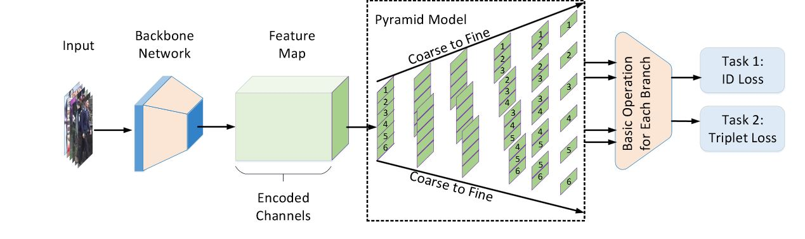

# [Pyramidal Person Re-IDentification via Multi-Loss Dynamic Training (CVPR 2019)](http://openaccess.thecvf.com/content_CVPR_2019/papers/Zheng_Pyramidal_Person_Re-IDentification_via_Multi-Loss_Dynamic_Training_CVPR_2019_paper.pdf). 

Most existing Re-IDentification (Re-ID) methods are highly dependent on precise bounding boxes that enable images to be aligned with each other. However, due to the challenging practical scenarios, current detection model soften produce inaccurate bounding boxes, which inevitably degenerate the performance of existing Re-ID algorithms. We propose a novel coarse-to-fine pyramid model to relax the need of bounding boxes, which not only incorporates local and global information, but also integrates the gradual cues between them. The pyramid modelis able to match at different scales and then search for the correct image of the same identity, even when the image pairs are not aligned. In addition, in order to learn discriminative identity representation, we explore a dynamic training scheme to seamlessly unify two losses and extractappropriate shared information between them. 



## Performance

||Market1501<br>mAP&rank-1</br>|DukeMTMC<br>mAP&rank-1</br>|weight|
|:-:|:-:|:-:|:-:|
|paper|88.2/95.7|79.0/89.0|[weight](https://drive.google.com/drive/folders/1vK30A-8FlQbQGVT-Wv9W9qMz-A74fv_3?usp=sharing)|
|this implement|88.6/95.2|80.4/89.6|[weight](https://drive.google.com/drive/folders/1vK30A-8FlQbQGVT-Wv9W9qMz-A74fv_3?usp=sharing)|

## Config
```yaml
yaml: 'experiment/Pyramid/Pyramid.yaml'
```
## Citation

If you are interested in this work, please cite our paper
```
@inproceedings{zheng2019pyramidal,
  title={Pyramidal Person Re-IDentification via Multi-Loss Dynamic Training},
  author={Zheng, Feng and Deng, Cheng and Sun, Xing and Jiang, Xinyang and Guo, Xiaowei and Yu, Zongqiao and Huang, Feiyue and Ji, Rongrong},
  booktitle={Proceedings of the IEEE Conference on Computer Vision and Pattern Recognition},
  pages={8514--8522},
  year={2019}
}
```
