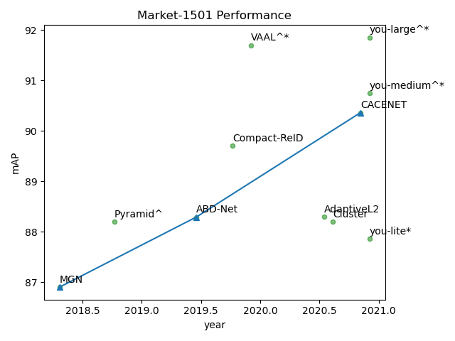
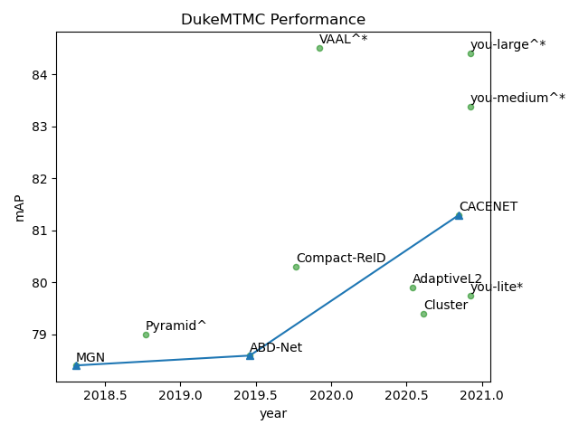

# YouReID model zoo 

## Introduction

This file documents collection of models trained with you-reid framework. All numbers were obtained with 2 NVIDIA V100 GPU. The software in use were PyTorch 1.6, CUDA 10.1.

We compare some state of the art models in the following pictures, using the performance in those paper.
 

"*" stands for using extra information, "^" stands for using larger backbone

## Models
<table>
    <tr>
        <th></th><th>Market1501 mAP/rank-1</th><th>DukeMTMC mAP/rank-1</th><th>MSMT17 mAP/rank-1</th><th>config</th><th>download</th>
    </tr>
    <tr>
        <td>baseline</td><td>87.65/94.80</td><td>77.21/88.33</td><td>54.61/78.80</td><td><a href="../example/baseline/baseline_dist_bn.yaml">config</a></td><td><a href="">weight</a> <a href="">log</a></td>
    </tr>
    <tr>
        <td>MGN</td><td>89.28/95.84</td><td>80.57/89.14</td><td>61.67/83.31</td><td><a href="../example/mgn/mgn.yaml">config</a></td><td><a href="">weight</a><a href="">log</a></td>
    </tr>
    <tr>
        <td>CACENET</td><td>90.00/95.67</td><td>81.13/89.90</td><td>61.9/83.77</td><td><a href="../example/cacenet/cacenet.yaml">config</a></td><td><a href="">weight</a><a href="">log</a></td>
    </tr>
</table>

||Market1501 mAP/rank-1|DukeMTMC mAP/rank-1|MSMT17 mAP/rank-1|config|download|
|:-:|:-:|:-:|:-:|:-:|
|baseline|87.65/94.80|77.21/88.33|54.61/78.80|[config](../example/baseline/baseline_dist_bn.yaml)|[weight]() [log]()|
|MGN|89.28/95.84|80.57/89.14|61.67/83.31|[config](../example/mgn/mgn.yaml)|[weight]() [log]()| 
|CACENET|90.00/95.67|81.13/89.90|61.9/83.77|[config](../example/cacenet/cacenet.yaml)|[weight]() [log]()|

#### multi sources
We contribute some reid samples to opencv community, you can use these model in [opencv](https://github.com/opencv/opencv/pull/19108), and you also can visit them at [ReID_extra_testdata](https://github.com/ReID-Team/ReID_extra_testdata).
The following table shows the performance of these model

||Market1501 mAP/rank-1|DukeMTMC mAP/rank-1|MSMT17 mAP/rank-1|config|download|
|:-:|:-:|:-:|:-:|:-:|
|youtu_reid_baseline_lite|87.86/95.01|79.75/89.05|58.82/80.81|[config](../example/baseline/baseline_lite_multidataset.yaml)|[weight](https://drive.google.com/file/d/1l-8Lj9OPs4D6qKGAljbJgZuxGvENkDjl/view?usp=sharing) [onnx_weight](https://drive.google.com/file/d/1CinUtnkO_r9120qEuL1c8EbMuYzql2Cu/view?usp=sharing) [log](https://drive.google.com/file/d/1QmmbU3c2Nw6UR5AGvU5B-v2kRiPKIJQ3/view?usp=sharing)|
|youtu_reid_baseline_medium|90.75/96.32|83.38/91.56|65.30/85.08|[config](../example/baseline/baseline_medium_multidataset.yaml)|[weight](https://drive.google.com/file/d/1bhOMl4masd63alS3HMZ060miyM7R31uR/view?usp=sharing) [onnx_weight](https://drive.google.com/file/d/1IztiK3reDiCXYdR_p73hvENeVZQfQLFb/view?usp=sharing) [log](https://drive.google.com/file/d/1ea0PiLYsTJ3vkjwgO3WMOzRsPdcQBpjk/view?usp=sharing)|
|youtu_reid_baseline_large|91.85/96.73|84.40/91.88|68.68/87.04|[config](../example/baseline/baseline_large_multidataset.yaml)|[weight](https://drive.google.com/file/d/1zoM1o_6o7otV0VfUxtCwj7O_AbBplWnu/view?usp=sharing) [onnx_weight](https://drive.google.com/file/d/1yU609diFdkre2j7f4rHxZWKO-vkS-04c/view?usp=sharing) [log](https://drive.google.com/file/d/1iP6sSSxofoeeb-6Q4BDjrD7ncWvT5TEP/view?usp=sharing)|

